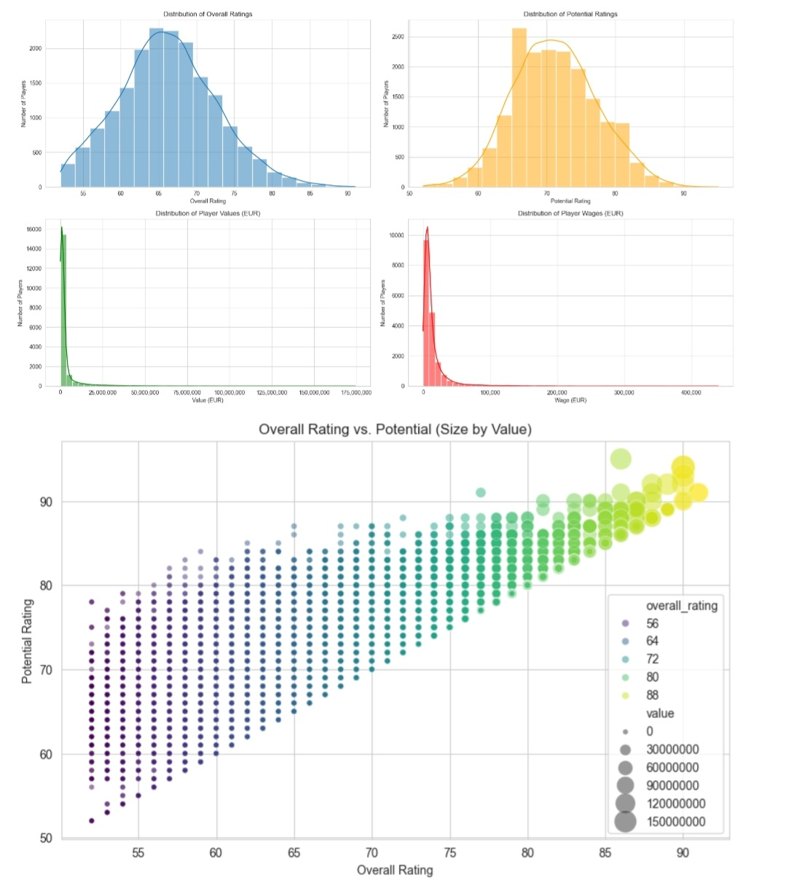

# FC 25 Player Data Analysis

## Project Overview

This project involves a comprehensive exploratory data analysis (EDA) of a dataset containing player statistics from the FC 25 video game (likely from a June 2025 update). The primary goal is to clean, transform, and analyze the raw player data to extract meaningful insights, identify key player trends, and pinpoint valuable talents, including high-potential future stars.

## Dataset Information

* *Source:* The dataset is provided as player-data-full-2025-june.csv.
* *Size:* Contains information on over 18,000 professional football players.
* *Content:* Includes various player attributes such as overall rating, potential, market value, wage, physical attributes (height, weight), preferred foot, positions, club information, and more.

## Analysis Goals

The main objectives of this analysis include:

1.  *Data Cleaning & Preprocessing:* Handling missing values, correcting data types (e.g., converting monetary values to numeric, dates to datetime objects), and addressing inconsistencies.
2.  *Initial Data Exploration:* Understanding the dataset's structure, summary statistics, and distributions of key player attributes.
3.  *Identifying Top Players:* Discovering players who excel in overall rating, market value, potential, and wages.
4.  *Finding High-Potential Talents:* Pinpointing younger players with significant room for growth, based on the difference between their potential and current overall rating.
5.  *Data Visualization:* Creating charts and graphs to visually represent player distributions and relationships between different attributes.

## Methodology

The analysis was conducted using Python in a Jupyter Notebook environment. Key steps involved:

* *Loading Data:* Reading the raw player-data-full-2025-june.csv into a pandas DataFrame.
* *Initial Inspection:* Using .info(), .head(), and .describe() to understand data types, non-null counts, and basic statistics.
* *Column Selection & Dropping:* Removing irrelevant or highly sparse columns, including an initial balance column identified as problematic.
* *Data Type Conversion:*
    * Monetary columns (value, wage, release_clause) were cleaned by removing currency symbols and 'M'/'K' suffixes, then converted to float64.
    * Date columns (dob, club_joined) were converted to datetime objects.
    * Other numerical columns were ensured to be in int64 or float64.
* *Statistical Summaries:* Generating descriptive statistics for numerical columns and value counts for categorical features (preferred_foot, body_type, positions).
* *Top Player Identification:* Sorting and displaying the top 10 players based on overall_rating, value, potential, and wage.
* *High Growth Potential Analysis:* Calculating the difference between potential and overall_rating to identify players with a growth potential of 10 points or more.
* *Data Visualization:* Utilizing matplotlib and seaborn to create:
    * Histograms showing distributions of overall_rating, potential, value, and wage.
    * A scatter plot visualizing the relationship between overall_rating and potential, with point size indicating value.

## Key Findings / Insights

* The dataset contained over 18,000 players with varied attributes.
* Initial cleaning was crucial due to mixed data types and the presence of non-numeric characters in monetary fields.
* *Top Player Dominance:* Elite clubs like Real Madrid and Manchester City prominently feature players across all "top 10" lists (Overall Rating, Value, Potential, Wage).
* *Market Value Disparity:* Player values and wages are highly skewed, with a small number of superstar players commanding exceptionally high figures, while the majority are valued much lower.
* *High-Potential Gems:* Analysis revealed numerous players with low current overall ratings (e.g., in the 50s) but significant growth potential (20+ points), suggesting valuable talents for future development, often found in diverse, less prominent leagues.
* *Overall Rating vs. Potential:* A strong positive correlation exists, with high-value players typically demonstrating both high current rating and high future potential.

## Files in this Repository

* FC25_Player_Analysis.ipynb: The Jupyter Notebook containing all the code for data cleaning, analysis, and visualization.
* player-data-full-2025-june.csv: The original, raw dataset used for this analysis.
* player_data_cleaned.csv: The cleaned and preprocessed version of the dataset after all transformation steps.

## Technologies Used

* Python 3
* Jupyter Notebook
* Pandas (for data manipulation and analysis)
* Matplotlib (for data visualization)
* Seaborn (for enhanced data visualization)
* NumPy (for numerical operations)

## How to Run This Project

To run this analysis locally, follow these steps:

1.  *Clone the repository:*
    bash
    git clone [https://github.com/datasosa/FC25_Player_Analysis.git](https://github.com/datasosa/FC25_Player_Analysis.git)
    
2.  *Navigate to the project directory:*
    bash
    cd FC25_Player_Analysis
    
3.  *Install dependencies:* Ensure you have Python installed. Then, install the required libraries using pip:
    bash
    pip install pandas matplotlib seaborn numpy
    
4.  *Launch Jupyter Notebook:*
    bash
    jupyter notebook
    
5.  *Open the notebook:* In the Jupyter interface that opens in your web browser, click on FC25_Player_Analysis.ipynb to open and run the analysis.

## Future Work

* Compare average player attributes across different leagues or clubs.
* Analyze player attributes specific to different positions (e.g., speed for wingers, defensive stats for defenders).
* Build predictive models to estimate player value or potential based on various attributes.
* Create interactive dashboards for deeper exploration.

## Contact

[Osasele Osagie on Linkedin](https://www.linkedin.com/in/Osas-Osagie]
